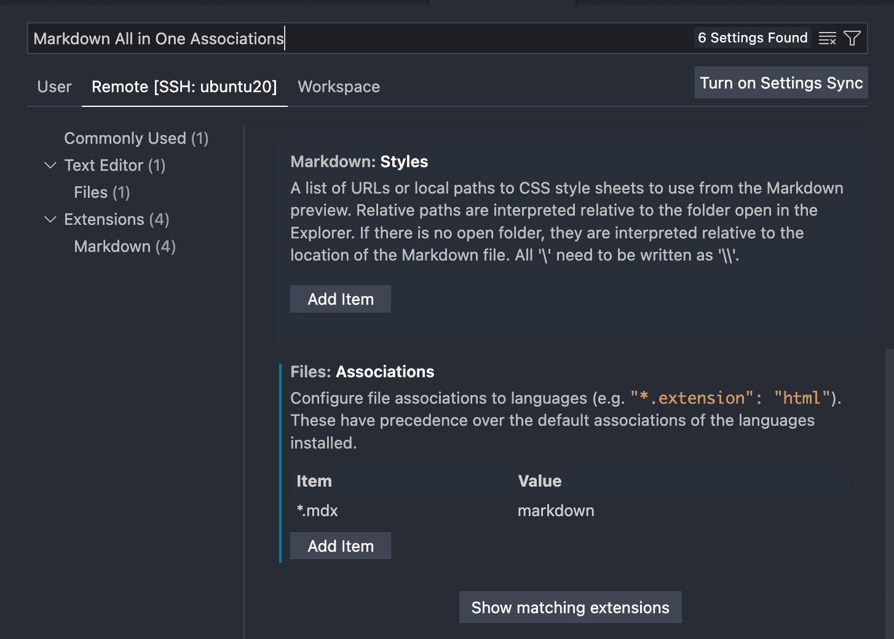

## TL;DR

- `mdx` 形式のファイルを Markdown All in One に関連づけると, `md` の時と同じように自動補完などが使えて書きやすい
  - やり方は VS Code の settings から `mdx` を `markdown` で解釈させるよう設定追加するだけ
- ただし 2022年5月29日現在で機能としては未対応なので JSX を書いた部分はハイライトされない

## MDX でブログを書いているのでもっと便利に書きたい

私はエディタは VS Code を使っており, 読書メモなんかも markdown で書いているので, VS Code 拡張である [Markdown All in One](https://marketplace.visualstudio.com/items?itemName=yzhang.markdown-all-in-one) には大変お世話になっています。
これを使うと, 例えば `-` や `1.` などでリストを書いたときに, Enter を押しただけで次の行頭に `-` や `2.` を自動挿入してくれたり, 単語を選択して `_` や `*` を入力するとその単語の前後に挿入してくれて, 強調などが楽になるなど, 良い感じの補完をしてくれます。また, 私はほぼ書きませんが, 数式も書けます。

しかし, 先日[はてなブログから Gatsby を使った自作ブログに移行](/2022/01/migration-to-gatsby)したことで, [mdx](https://mdxjs.com/) でブログを書くようになりました (今のところブログ移行の話を毎回書いてる気がする)。

この記事も mdx で書いているのですが, 残念ながら MArkdown All in One は 2022年5月29日現在, mdx に対応していません。
それでも mdx はほぼ markdown だし, JSX を書かないこともあるので, なんとか Markdown All in One を mdx でも使えないか調べました。

## 結論: VS Code の設定で mdx を関連づければ良いだけ

1. `Ctrl (Command)` + `Shift` + `P` でコマンドパレットを開く
2. `settings` と入力
3. 出た候補の中から `Preferences: Open Workspace Settings` を開く (現在のワークスペースのみに反映させたい場合。常に適用したい場合は, ローカルの場合は `Open Settings (UI)`, Remote Code で開発している場合は `Open Remote Settings (SSH: <HOST>)`)
4. `Markdown All in One Associations` などで検索し, `Files: Associations` の `Item` に `*mdx`, `Value` に `markdown` と入力

    

5. または `settings.json` を直接編集する場合は, 以下のように記述

    ```json
    {
        "files.associations": {
            "*.mdx": "markdown"
        }
    }
    ```

## 調査内容

ということで, プラグインのオプションから関連づけてやればいいだけでした。一応ここに至るまで少し調べもしたので, その内容を書いておきます。

やはり同じことを考えた方はいたようで, Markdown All in One のリポジトリの Issue が存在しました。  
[Suggestion: Allow extension to work within MDX files #758](https://github.com/yzhang-gh/vscode-markdown/issues/758)

この Issue は 2022年5月29日現在, Open のままです。ただし, 上で書いたような暫定解決策が, プラグイン作者である yzhang-gh さんによって[コメント](https://github.com/yzhang-gh/vscode-markdown/issues/758#issuecomment-662959624)されています。私もこれを読んで解決しました。

なお, [Allow extension to activate in MDX files #759](https://github.com/yzhang-gh/vscode-markdown/pull/759) で一度実装されたのですが, 実装が不適切だったようで revert されてますね。Issue は Closed になってますが, Issue #758 の通り依然根本解決はしていないままです。

## 補足: この解決法の問題や Gatsby での MDX 利用でつらいところ

なお, この解決法は, 単純に `mdx` ファイルを `markdown` として認識させただけです。__MDX にあって Markdown にない, JSX などの記法は当然 Markdown All in One 本家が未対応なので, ハイライトされません__。

また, このブログは Gatsby を利用していますが, __2022年5月29日現在, Gatsby は MDX v2.0 に対応していません__。
[MDX 公式](https://mdxjs.com/blog/v2/)によると, MDX v2.0 では JavaScript の式が評価されるようになったり, コンパイル速度が速くなったり, バンドルサイズが小さくなったり, markdown 記法と JSX の組み合わせがより柔軟になったりと, 嬉しいことが多いので是非対応を待ちたいですね。

例えば MDX v2 では以下のようなコードを書いたときに, JSX の内部に markdown 記法で書いた文字列もちゃんと markdown として評価してくれます！ (v1 では `# hi?` は `<h1><h1?/h1>` にならないのです。素直に書いて評価されなかった時は思わずため息が出る気持ちになった)

```jsx
<div>*hi*?</div>

<div>
  # hi?
</div>

<main>
  <div>

    # hi?

  </div>
</main>
```

Gatsby 公式でも着々と対応の準備は進んでいるようなので, 楽しみに待ちたいですね。  
[Feat: MDX v2 #35650](https://github.com/gatsbyjs/gatsby/pull/35650)
