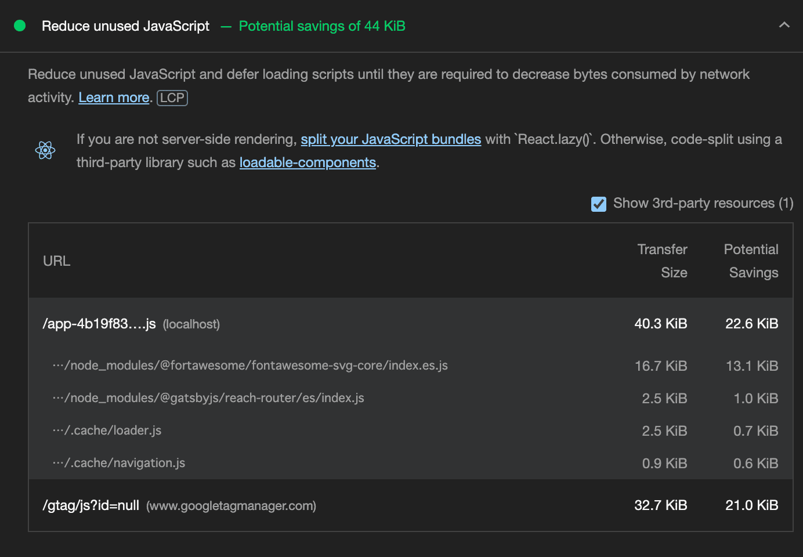
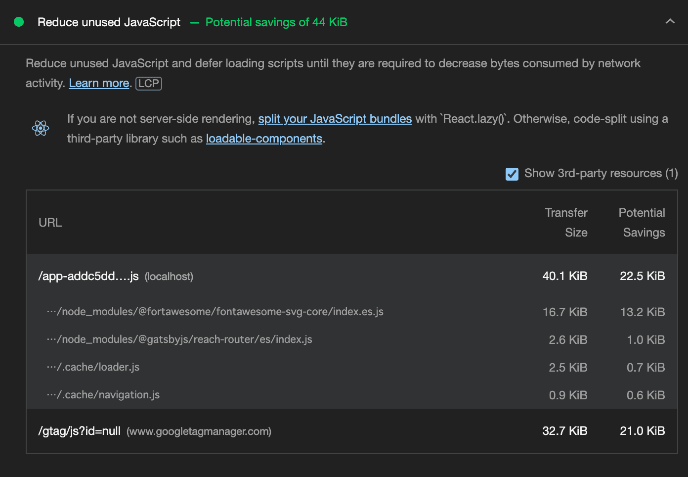

import Note from '../../../src/components/util/Note.tsx';

<Note>
  本記事はフロントエンド技術に関わるものですが,
  筆者はフロントエンドを本業でやっている人間ではありません。 また,
  本記事の結果は, あくまで偏った
  1サンプルの結果のメモに過ぎないことにご留意ください。
</Note>

## TL;DR

- Gatsby で React 17 から使える new JSX transform を試してみた
- パフォーマンスやバンドルサイズに影響が出るかと思い旧来の方式と比較した
  - 結果はパフォーマンスもバンドルサイズも旧方式の方が良かった
  - ただし偏ったサンプルの結果であるので注意。おそらくそれなりの規模の環境では, 公式ドキュメントにあるように新方式の方がパフォーマンスやバンドルサイズが改善すると思われる。

## きっかけ: 自分のソースコードから `import React from 'react';` を消してスッキリさせたい

先日, ブログをはてなブログから Gatsby を利用した自作ブログへと移行しました[^1]。
より保守性・生産性の高いコードにしたい, スキルを身につけたいという思いがあり, TypeScript で実装しようと当初考えたのですが, とりあえずものを作りたかったので, ひとまず JavaScript で実装しました。

そろそろ TypeScript への移行を始めたいと思いましたが, まだまだ React のことも理解できていないので, React と TypeScript を一緒に学べる[『りあクト！ TypeScript で始めるつらくない React 開発』シリーズ](https://oukayuka.booth.pm/)を読み直していました。

すると, 気になる記述が目に入りました。

> 「...React 17.0 以降はパフォーマンス改善などを目的とした新しい変換形式が導入されてて、Create React App でも 2020 年 10 月にリリースされた 4.0 からはデフォルトの設定はそっちが有効になってるのね。...」[^2]

> 「...ちなみに TypeScript 4.1 以降では React 17.0 から導入された新しい JSX 変換形式に対応してて、`tsconfig.json` の `jsx` オプション設定が `react-jsx` になってるとそれが有効になる。こっちはこんなふうにインポート文込みで変換されるので、`import React from 'react'` が省略できるよ」[^3]

詳しくは React 公式の [Introducing the New JSX Transform](https://reactjs.org/blog/2020/09/22/introducing-the-new-jsx-transform.html) で紹介されているのですが, つまるところ以下の内容です。

- React 17.0 から JSX の変換で, `React.createElement()` に変換されない新形式が使えるようになった
- 新形式では `import React from 'react'` のインポート文が不要になる

そして, 新方式の恩恵として, 上記の React のドキュメントでは以下が挙げられています。

> - With the new transform, you can use JSX without importing React.
> - Depending on your setup, its compiled output may slightly improve the bundle size.
> - It will enable future improvements that reduce the number of concepts you need to learn React.

確かに, Gatsby でコードを書いているとき, **全ての JSX ファイルの冒頭に `import React from 'react';` を書いており**, 冗長だなと思っていました。
もはや JSX ファイルを作成したらまず無心でタイプする, 魔法の文字列じみた状態でした。
それが省略でき, かつパフォーマンスなども上がるのであれば, これは是非導入してみたい。
ただし, 先ほども触れたように, 私はまだ TypeScript を修得していないので, TypeScript 前提で書かれている『りあクト！』の記述をそのままは使えません。
JavaScript で, かつ Gatsby でこの新方式を導入できるのか調べる必要があります。

ということで, **本記事では, Gatsby + JavaScript で React の JSX Transform の新方式を利用する方法** を調べました。
また, 旧方式とのパフォーマンス比較も, せっかくなのでごく簡易にではありますが試してみました。

## Gatsby で React JSX Transform の新方式を導入する

TypeScript であれば, `tsconfig.json` を編集すれば良いようです。
しかし, Gatsby ではどうすれば良いか。

### Gatsby の設定

検索していたら, まず次の issue にたどり着きました。  
[React 17 new JSX Transform: ReferenceError: React is not defined #28657](https://github.com/gatsbyjs/gatsby/issues/28657)

この Issue の末尾から, 根本的に解決された Issue も確認できました。  
[feat(gatsby): Add JSX Runtime options to gatsby-config.js #33050](https://github.com/gatsbyjs/gatsby/pull/33050)

どうやら, Gatsby でもちゃんと新方式に対応しているようです。
ちなみにリリースノートもちゃんとあり, Gatsby 4.1 から対応したようでした。  
[JSX Runtime Options in `gatsby-config.js`](https://www.gatsbyjs.com/docs/reference/release-notes/v4.1/#jsx-runtime-options-in-gatsby-configjs)

これらの記述によれば, `gatsby-config.js` に以下のエントリを足してやれば良いようです。

```js:title=gatsby-config.js
module.exports = {
  jsxRuntime: 'automatic',
};
```

### ESLint の設定

これで無事冗長な `import React from 'react';` を消せる, と思って消したら, ESLint に怒られました。
`Prevent missing React when using JSX (react/react-in-jsx-scope)` に抵触しているようです。
それはそう。

[抵触したこのルールのドキュメント](https://github.com/jsx-eslint/eslint-plugin-react/blob/master/docs/rules/react-in-jsx-scope.md)に飛ぶと, 末尾に以下のように書かれています。

> If you are using the [new JSX transform from React 17](https://reactjs.org/blog/2020/09/22/introducing-the-new-jsx-transform.html#removing-unused-react-imports), you should disable this rule by extending [`react/jsx-runtime`](https://github.com/jsx-eslint/eslint-plugin-react/blob/8cf47a8ac2242ee00ea36eac4b6ae51956ba4411/index.js#L165-L179) in your eslint config (add `"plugin:react/jsx-runtime"` to `"extends"`).

素直に従って, ESLint の設定ファイルに追記しましょう。
私の場合は, `.eslintrc.json` の `"extends"` 部分が以下のようになりました。

```json:title=.eslintrc.json
  "extends": [
    "eslint:recommended",
    "plugin:import/recommended",
    "plugin:jsx-a11y/recommended",
    "plugin:react/recommended",
    "plugin:react/jsx-runtime",
    "plugin:react-hooks/recommended",
    "prettier"
  ],
```

これで, `import React from 'react';` を消しても ESLint に怒られなくなりました。
安心して全ての jsx ファイルから冒頭一行を消し去ります。
ビルドも無事できたので, 問題なさそうです。

## 新旧方式でのパフォーマンス比較

せっかくなので, パフォーマンスが良くなるということなので計測してみます。
と言っても全然記事のないブログで, 大して凝った作りもしていないので, 厳密ではなく簡易に様子を見る程度でやってみます。

### 環境情報

- 主要 npm package

  ```shell-session
  kangetsu@ubuntu20:~/work/my_blog$ npm ls | grep -E ' gatsby@| react@| react-dom@'
  ├── gatsby@4.12.1
  ├── react-dom@17.0.2
  ├── react@17.0.2
  kangetsu@ubuntu20:~/work/my_blog$
  ```

### ビルドタイム

まず, ビルドタイムを測ってみます。
Gatsby なので, `gatsby clean` 後に `gatsby build` の時間を見ます。

とりあえず 5 回分計測しました, 結果は以下の通り (単位: sec)。

|        | 旧    | 新    |
| :----- | :---- | :---- |
| 1 回目 | 30.89 | 34.67 |
| 2 回目 | 32.26 | 34.03 |
| 3 回目 | 32.25 | 35.20 |
| 4 回目 | 31.99 | 34.37 |
| 5 回目 | 30.06 | 33.69 |
| 平均   | 31.49 | 34.39 |

正直結果を疑いましたが, 私の手元では旧方式の方が早かったです。

### バンドルサイズ

では, せめてバンドルサイズは良くなっているのではないか。これは一回計測すれば十分です。
Gatsby では, `public/` 以下に出力されるので, このサイズを比べます。

|             | 旧   | 新   |
| :---------- | :--- | :--- |
| サイズ (KB) | 4208 | 4212 |

ここでも わずかながら旧方式の方が軽いという, 旧方式の方が優れた結果となりました。

### パフォーマンス

最後の頼みの綱, パフォーマンスです。
どう測るか迷いましたが, CLI の [lighthouse](https://www.npmjs.com/package/lighthouse) を使うことにしました。

と言ってもそのまま実行したら大量にログが出たので, [mizchi さんの記事](https://qiita.com/mizchi/items/105308f44cb1cc18fa8a)を参考に, 必要なデータだけ抜き出しました。
中身がほぼない軽量なブログなので, 結果としてはほぼ天井を打っていたので, 差分だけ抽出します。
diff をとった結果は以下です。

```shell-session
$ diff default_lighthouse_score.log new_lighthouse_score.log
59c59
<   'unused-javascript': 0.93,
---
>   'unused-javascript': 0.88,
```

差分はこの 'unused-javascript' のみですが, 見方を間違えてなければ, やはり旧方式の方がスコアが優れていました。

#### unused-javascript はどこで差が出ているのか？

一体どこで差が出たのか。
lighthouse の CLI では, 具体的にどの JavaScript がどれくらいのサイズなのか, などはパッと出せなかったので, 結局 GUI の lighthouse で確認しました。

**旧方式:**



**新方式:**



数字上は, 以下の違いがあります。

- `app-[0-9a-z]+\.js` の Transfer Size が旧方式の方が大きいが, Potential Savings も大きい
- `fontawesome-svg-core/index.es.js` の Potential Savings が 0.1KiB 小さい

あとは誤差レベルのもののようです。
細かい数字が異なるのは分かりますが, 新旧どちらも "Potential saving of 44 KiB" と, 潜在的な削減可能容量は 44KiB と表示されています。
すなわち, 削減可能サイズも少なくとも 1KiB = 1024 Byte 内の誤差ではあるようです。

lighthouse の 'unused-javascript' のスコア算出方法がどうなっているのか次第ですが, またドツボにハマって「気楽に記事を書く」が達成できなくなるので, 今回は深追いするのはやめておきます。

## まとめ

ということで, 私の環境では新方式の JSX Transform を使ってもパフォーマンスの向上は見られませんでした。
しかし, 冒頭に書いた通り, 計測の方法も環境も適切とは言えないので, 参考にしなくて良いと思います。
パフォーマンス値については気になって調べて, せっかくなのでメモとして記録を残した, というのみです。
私は **`import React from 'react';` を削除できただけで満足** です。
もし React を書いていて, 冗長なコードが気になる方は, ぜひ新方式の JSX Transform を利用してみると良いかなと思います。

[^1]: 移行報告は [過去の記事](/2022/01/migration-to-gatsby) で書いています。
[^2]: 大岡由佳, [りあクト！ TypeScript で始めるつらくない React 開発 第 3.1 版【Ⅱ. React 基礎編】](https://oukayuka.booth.pm/items/2368019), p.12.
[^3]: 大岡由佳, [りあクト！ TypeScript で始めるつらくない React 開発 第 3.1 版【Ⅱ. React 基礎編】](https://oukayuka.booth.pm/items/2368019), p.30.
